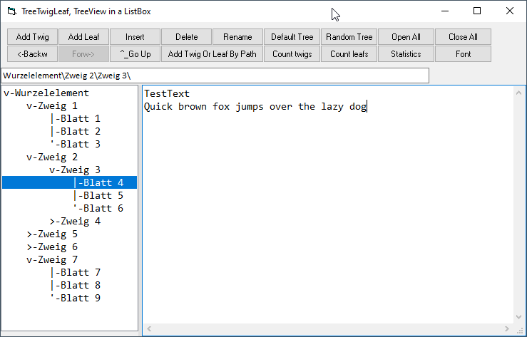

# TreeTwigLeaf  
## TreeTwigLeaf, TreeView in a ListBox  

 

Project started in sep.2017, for compiling it you need the class Splitter from the repo Ctrl_Splitter and the class FontDialog from the repo Win_Dialogs. 
If you do not have access to a TreeView-control, e.g. in VBA7 Excel 64-bit you could use a simple ListBox instead, and add the treetwigleaf classes  

